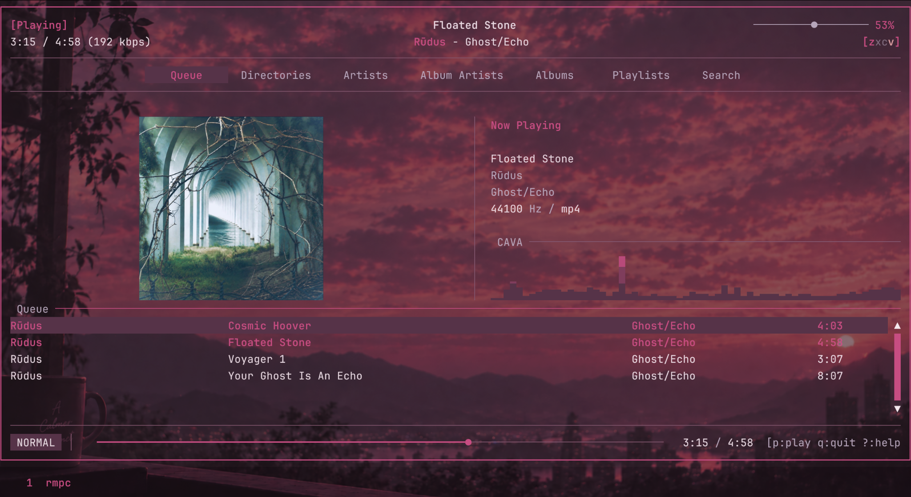
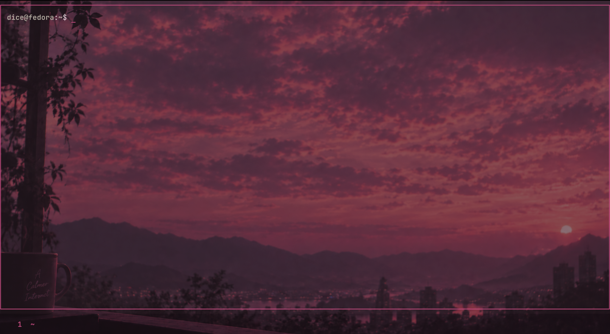

# Rose Room · Sunset Rose

A coordinated Kitty terminal and RMPC music-player setup inspired by a rose-colored sunset: dark plum surfaces, warm text, muted mauve ANSI blue, and a deep pink accent.

This repository packages the **last Sunset Rose / cinema selection** from `rose-room-apply.py`, together with the supplied screenshots and wallpaper.

## Quick install — one command

Download and extract this repository, open a terminal in its folder, then run:

```bash
bash install.sh
```

**التطبيق بأمر واحد:** فك الضغط، افتح الطرفية داخل المجلد، وشغّل الأمر أعلاه. المثبّت يفحص المتطلبات، يأخذ نسخة احتياطية، ويطبق إعدادات Kitty وRMPC. لو الإعدادات غير موجودة ينشئها، ولو موجودة يحافظ على اتصال MPD واختصارات RMPC.

To undo this installer:

```bash
bash install.sh --restore
```

Optional validation without changing configuration files:

```bash
bash install.sh --check
```

Run without `sudo`. The installer uses your `XDG_CONFIG_HOME` or `~/.config`, reads the exported configs/themes in this repository, and saves exact file backups under `rose-room-github-backups/` there. It refuses to overwrite edits made after installation during restore. Symlink-based dotfile setups should use the manual route below.

Kitty, RMPC 0.11.x, CAVA and the font must already be installed. Missing programs or an incompatible detected version stop installation before configuration changes. The installer checks the font when `fc-match` is available. It does not install packages, configure your MPD service, or change the desktop wallpaper. Set the included wallpaper through desktop settings; an existing working MPD/CAVA setup needs no changes.

## Preview

### RMPC



### Kitty



### Wallpaper


The screenshots and wallpaper above are the supplied originals. Screen size, desktop scaling, window placement and the compositor affect the final appearance.

## Included files

| File | Purpose |
| --- | --- |
| `kitty/kitty.conf` | Font, transparency, padding, cursor, window borders and bottom tabs |
| `kitty/themes/sunset-rose.conf` | Kitty colors, all 16 ANSI colors and tab colors |
| `rmpc/config.ron` | MPD connection, controls, mouse, album art, CAVA input and native tabs |
| `rmpc/themes/rose-room-sunset-cinema.ron` | RMPC colors, layout, queue, metadata, artwork and CAVA styling |
| `install.sh` / `scripts/install.py` | One-command installer, validation, backup and restore using the exported repository files |
| `rose-room-apply.py` | Original installer for applying this selection to existing configs, with backup and restore |
| `selection.txt` | Original exported preview choices |
| `LICENSE` | The Unlicense (public domain) |
| `assets/screenshots/` | Kitty and RMPC screenshots |
| `assets/wallpapers/rose-room-sunset.png` | Original wallpaper |

## Appearance

| Setting | Value |
| --- | --- |
| Background | `#281923` |
| Foreground | `#E9D9E2` |
| Accent / cursor | `#C74D82` |
| Muted mauve / ANSI blue | `#B6A5BA` |
| Selection | `#563348` |
| Kitty opacity | `0.55` — **45% transparency** |
| Font | JetBrains Mono, 17.7 pt, 120% cell height |
| Kitty tabs | Bottom, separator style, 12 pt vertical margins |
| Cursor | Underline, no blinking |
| RMPC navigation | Seven native horizontal tabs, mouse enabled |
| Queue layout | Artwork and metadata/CAVA above a full-width queue |

The theme assigns 60% of the queue tab's content height to artwork and metadata/CAVA, and 40% to the queue. Album art uses 52% of the upper row's width, with a configured image limit of 1200 × 1200 pixels. Actual artwork size depends on the available terminal cells and source image.

## Requirements

- Kitty **0.47.1** is the configuration target.
- RMPC **0.11.x**; the included installer enforces this version family.
- JetBrains Mono installed and available to Kitty.
- A working MPD setup. The exported config connects to `127.0.0.1:6600` with no password.
- CAVA available on `PATH`, with MPD producing the matching FIFO audio stream.
- Python 3 for the one-command installer.

The desktop in the supplied screenshots uses the included wallpaper. Set it through your desktop's wallpaper settings. Kitty uses `background_image none`; the installer does not set the desktop wallpaper. Transparency depends on the compositor. See the [Kitty configuration reference](https://sw.kovidgoyal.net/kitty/conf/).

## Manual alternative: install the exported files

Use this route to install the files in this repository, including any edits you make to them. Run the commands from the extracted repository directory, as your normal desktop user.

The following Bash block backs up existing Kitty and RMPC directories before copying the four configuration/theme files. It prints the backup location; keep that path if you want to undo the installation. Review `rmpc/config.ron` first if your MPD address or controls differ.

```bash
set -e
rose_config_root="${XDG_CONFIG_HOME:-$HOME/.config}"
mkdir -p "$rose_config_root"
rose_backup_dir="$(mktemp -d "$rose_config_root/rose-room-manual-backup.XXXXXXXX")"

for rose_app in kitty rmpc; do
    if [ -e "$rose_config_root/$rose_app" ]; then
        cp -a "$rose_config_root/$rose_app" "$rose_backup_dir/$rose_app"
    fi
done

mkdir -p "$rose_config_root/kitty/themes" "$rose_config_root/rmpc/themes"
cp kitty/kitty.conf "$rose_config_root/kitty/kitty.conf"
cp kitty/themes/sunset-rose.conf "$rose_config_root/kitty/themes/sunset-rose.conf"
cp rmpc/config.ron "$rose_config_root/rmpc/config.ron"
cp rmpc/themes/rose-room-sunset-cinema.ron "$rose_config_root/rmpc/themes/rose-room-sunset-cinema.ron"
printf 'Backup: %s\n' "$rose_backup_dir"
```

Close and reopen Kitty, then launch `rmpc`. If Kitty already uses an explicit custom `--config` path, install the files there instead and preserve the relative `themes/` directory.

To undo a manual install, close both applications and restore the previous `kitty.conf` and `config.ron` from the printed backup directory to their original locations. Restore either corresponding theme file too if it previously existed; otherwise remove the newly installed theme file. The script's `--restore` command only undoes installations made by that script, not these manual copies.

## Legacy installer: original embedded selection

The new `install.sh` is the primary installation route. The original installer is retained for reproducing the earlier application and for undoing an installation originally made with that script. It preserves existing Kitty settings/includes and adds a final override block. In RMPC it changes the selected theme, tab definitions and mouse setting, and writes the new theme. Other settings, such as the MPD connection and keybindings, stay as they are.

Both existing configuration files must already exist. Run on your desktop host where RMPC is installed:

```bash
python3 rose-room-apply.py --check
python3 rose-room-apply.py
```

The first command checks the proposed configuration without applying it. The second saves backups under `${XDG_CONFIG_HOME:-$HOME/.config}/rose-room-backups/` and applies the selection. Reapplying an unchanged selection is a no-op.

To undo a script installation:

```bash
python3 rose-room-apply.py --restore
```

Restore checks for newer edits before overwriting files. If it stops, keep those edits and use the printed backup location to compare the files manually. An existing recorded installation must be restored before applying a different selection through this installer.

**The installer contains its own embedded snapshot.** Editing `kitty/` or `rmpc/` in this repository does not change what the installer applies. Use the manual route above to install edited exported files; choose one installation route.

## MPD and CAVA

The exported RMPC config expects a FIFO at `/tmp/mpd.fifo`, with 44100 Hz, 16-bit stereo audio. CAVA must be installed. If your current MPD setup already provides this, keep it.

For a new MPD setup, add a matching FIFO output to your existing MPD configuration, alongside the output that plays audio:

```conf
audio_output {
    type   "fifo"
    name   "Rose Room visualizer"
    path   "/tmp/mpd.fifo"
    format "44100:16:2"
}
```

Reload or restart MPD according to your existing service setup and ensure this output is enabled. This repository does not include or replace your MPD music-library, device or service configuration. The FIFO and matching input follow the [official RMPC CAVA setup](https://rmpc.mierak.dev/configuration/cava/).

## Controls

These bindings are included in the exported `rmpc/config.ron`:

| Key | Action |
| --- | --- |
| `1`–`7` | Queue, Directories, Artists, Album Artists, Albums, Playlists, Search |
| `Tab` / `Shift+Tab` | Next / previous tab |
| `p` | Toggle pause |
| `s` | Stop |
| `>` / `<` | Next / previous track |
| `f` / `b` | Seek forward / back |
| `.` / `,` | Volume up / down |
| `?` | Show help |
| `q` | Quit RMPC |

RMPC's tab row uses the native Tabs pane with mouse support enabled. Music, tags and album art come from your MPD library; the track and artwork shown in the screenshot are not included as media files.

## Scope and validation

- Kitty's exported configuration combines the previously supplied base settings with the final installer's overrides. Colors are split into a relative theme include.
- RMPC's exported configuration uses the supplied baseline with the same three field changes as the installer. Its theme is byte-for-byte the embedded final theme.
- These files reconstruct the supplied setup; they are not a live export of every setting on your computer. Unknown local changes, shell customizations and desktop settings are not included.
- The exported RMPC configuration and theme were accepted by RMPC **0.11.0** up to the deliberate connection attempt to a nonexistent MPD socket. No live MPD server was contacted during that check.
- The one-command installer passed isolated fresh-install, existing-install, check-only, repeated-install, exact-restore, newer-edit protection, malformed-config and missing-dependency checks. Those tests used real RMPC 0.11.0 parsing and simulated Kitty/CAVA/font availability; no desktop settings were changed.
- Kitty's effective exported settings were compared with the source settings. A native Kitty GUI launch, live playback, desktop image rendering and CAVA operation were not tested in the packaging environment.
- Some values in `selection.txt` describe the HTML preview (CSS pixels, backdrop and preview sizing). The native configs are the installation source of truth.

## License

The configuration files and scripts are released into the public domain under [The Unlicense](LICENSE). The wallpaper image in `assets/wallpapers/` is not covered by this license; its rights remain with its original creator.
